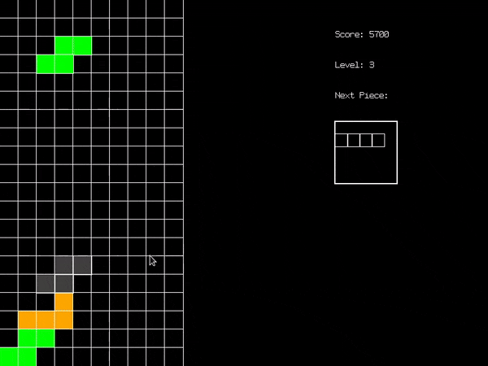

# Tetris Development Guide: Implementing a Ghost Piece Entity

In this guide, we'll walk through the process of adding a Ghost Piece Entity to our Tetris game. A ghost piece is a semi-transparent version of the current Tetromino that shows where it will land, helping players make more informed decisions about piece placement.

## 1. Creating the GhostPieceEntity Class

### Step 1: Create GhostPieceEntity.hpp

Create a new file `Entity/include/GhostPieceEntity.hpp`:

```c++
#pragma once
#include "Entity.hpp"
#include "Tetromino.hpp"
#include "Board.hpp"

class GhostPieceEntity : public Entity {
public:
  GhostPieceEntity(const Tetromino& tetromino, const Board& board);

  void update(float deltaTime) override;
  void draw(sf::RenderWindow& window) const override;

  void updatePosition(const Tetromino& tetromino, const Board& board);

private:
  std::vector<sf::RectangleShape> m_blocks;
};
```

**Why?**
- We inherit from the Entity class to maintain consistency with other game entities.
- We provide methods to update and draw the ghost piece.
- The `updatePosition` method will be used to recalculate the ghost piece's position based on the current Tetromino and board state.

### Step 2: Implement GhostPieceEntity.cpp

Create a new file `Entity/src/GhostPieceEntity.cpp`:

```c++
#include "GhostPieceEntity.hpp"

namespace {
const float BLOCK_SIZE = 30.0f;
const sf::Color GHOST_COLOR(128, 128, 128, 128);  // Semi-transparent grey
}

GhostPieceEntity::GhostPieceEntity(const Tetromino& tetromino, const Board& board) {
  updatePosition(tetromino, board);
}

void GhostPieceEntity::update(float deltaTime) {
  // No update logic needed for now
}

void GhostPieceEntity::draw(sf::RenderWindow& window) const {
  for (const auto& block : m_blocks) {
    window.draw(block);
  }
}

void GhostPieceEntity::updatePosition(const Tetromino& tetromino, const Board& board) {
  m_blocks.clear();

  Tetromino ghostTetromino = tetromino;
  while (!board.isCollision(ghostTetromino)) {
    ghostTetromino.move(0, 1);
  }
  ghostTetromino.move(0, -1);

  for (const auto& block : ghostTetromino.getBlocks()) {
    sf::RectangleShape shape(sf::Vector2f(BLOCK_SIZE, BLOCK_SIZE));
    shape.setPosition(block[0] * BLOCK_SIZE, block[1] * BLOCK_SIZE);
    shape.setFillColor(GHOST_COLOR);
    shape.setOutlineColor(sf::Color::White);
    shape.setOutlineThickness(1.0f);
    m_blocks.push_back(shape);
  }
}
```

**Why?**
- We calculate the position of the ghost piece by moving a copy of the current Tetromino down until it collides with the board.
- We use a semi-transparent color to visually distinguish the ghost piece from the actual Tetromino.
- The `updatePosition` method allows us to recalculate the ghost piece's position whenever the current Tetromino moves.

## 2. Integrating GhostPieceEntity into the Game

### Step 1: Update Game.hpp

Modify `Game.hpp`:

```c++
#pragma once

#include <SFML/Graphics.hpp>
#include "GameState.hpp"
#include "TetrominoEntity.hpp"
#include "BoardEntity.hpp"
#include "GhostPieceEntity.hpp"
#include "Renderer.hpp"
#include "Camera.hpp"
#include "GameUI.hpp"

// ... (other code remains the same)

class Game {
public:
  Game();
  void run();

private:
  // ... (other methods)

  sf::RenderWindow m_window;
  Renderer m_renderer;
  Camera m_camera;
  GameState m_gameState;

  TetrominoEntity m_currentTetrominoEntity;
  GhostPieceEntity m_ghostPieceEntity;
  BoardEntity m_boardEntity;

  // ... (other members)
};
```

**Why?**
- We include the GhostPieceEntity header.
- We add a GhostPieceEntity member to the Game class.

### Step 2: Update Game.cpp

Modify `Game.cpp`:

```c++
#include "Game.hpp"

Game::Game()
    : m_window(sf::VideoMode(800, 600), "TetrisSFML")
    , m_renderer(m_window)
    , m_camera(800.f, 600.f)
    , m_currentTetrominoEntity(m_gameState.getCurrentTetromino())
    , m_ghostPieceEntity(m_gameState.getCurrentTetromino(), m_gameState.getBoard())
    , m_boardEntity(m_gameState.getBoard())
    // ... (other initializations)
{
    initializeGame();
}

void Game::render() {
    m_renderer.beginDraw();

    m_boardEntity.draw(m_window);
    m_ghostPieceEntity.draw(m_window);
    m_currentTetrominoEntity.draw(m_window);
    m_gameUI.draw(m_window);

    m_renderer.endDraw();
}

void Game::updateEntities() {
    m_currentTetrominoEntity.updateFromTetromino(m_gameState.getCurrentTetromino());
    m_ghostPieceEntity.updatePosition(m_gameState.getCurrentTetromino(), m_gameState.getBoard());
    m_boardEntity.updateFromBoard(m_gameState.getBoard());
}

void Game::resetGame() {
    m_gameState = GameState();
    m_currentTetrominoEntity.updateFromTetromino(m_gameState.getCurrentTetromino());
    m_ghostPieceEntity.updatePosition(m_gameState.getCurrentTetromino(), m_gameState.getBoard());
    m_boardEntity.updateFromBoard(m_gameState.getBoard());
    m_gameMode = GameMode::Playing;
    m_gameUI = GameUI();
}

// ... (other methods remain the same)
```

**Why?**
- We initialize the GhostPieceEntity in the Game constructor.
- We update the render method to draw the ghost piece between the board and the current Tetromino.
- We update the `updateEntities` method to recalculate the ghost piece's position whenever the current Tetromino moves.
- We update the `resetGame` method to reset the ghost piece along with other game elements.

## 3. Updating the Build System

Update `Entity/CMakeLists.txt`:

```cmake
add_library(TetrisEntity
        src/Entity.cpp
        src/BoardEntity.cpp
        src/TetrominoEntity.cpp
        src/GhostPieceEntity.cpp
)

target_include_directories(TetrisEntity PUBLIC include)

target_link_libraries(TetrisEntity PUBLIC sfml-graphics TetrisCore)
```

**Why?**
- We add GhostPieceEntity.cpp to the list of source files for the TetrisEntity library.

## Result

With these changes, we've successfully implemented a Ghost Piece Entity in our Tetris game:

1. We've created a GhostPieceEntity class to represent and manage the ghost piece.
2. We've integrated the GhostPieceEntity into our main Game class.
3. We've updated the game loop to render and update the ghost piece.
4. We've updated our build system to include the new GhostPieceEntity files.

These improvements enhance the gameplay by providing a visual guide for players to see where their current Tetromino will land. This can help players make more strategic decisions about piece placement.


