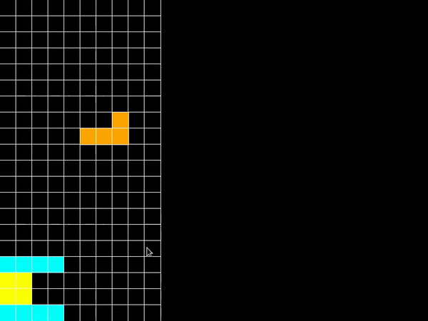

# Tetris Development Guide: Implementing Soft Drop, Hard Drop, and Rotation

In this guide, we'll focus on three key improvements to our Tetris game:
1. Implementing soft drop
2. Implementing hard drop
3. Adding rotation for Tetrominos

## 1. Implementing Soft Drop

Soft drop allows players to accelerate the falling speed of the current Tetromino.

### Step 1: Update GameState.hpp

```c++
class GameState {
public:
  // ... (other methods)
  void softDrop();

private:
  // ... (other members)
  float softDropTimer;
};
```

### Step 2: Implement Soft Drop in GameState.cpp

```c++
void GameState::update(float deltaTime) {
  fallTimer += deltaTime;
  softDropTimer += deltaTime;

  float fallSpeed = 0.5f;
  fallSpeed = std::max(fallSpeed, 0.1f);  // Minimum fall speed
  float softDropSpeed = fallSpeed / 4.0f;  // Soft drop is 4 times faster

  if (softDropTimer >= softDropSpeed) {
    softDropTimer = 0;
    softDrop();
  } else if (fallTimer >= fallSpeed) {
    fallTimer = 0;
    if (board.isCollision(currentTetromino.getMovedPosition(0, 1))) {
      lockTetromino();
    } else {
      currentTetromino.move(0, 1);
    }
  }
}

void GameState::softDrop()
{
  softDropTimer = 0;  // Reset the soft drop timer
  if (board.isCollision(currentTetromino.getMovedPosition(0, 1))) {
    lockTetromino();
  } else {
    currentTetromino.move(0, 1);
  }
}
```

**Why?**
- We've added a `softDropTimer` to control the soft drop speed.
- Soft drop moves the Tetromino down faster than the normal fall speed.
- We reset the soft drop timer after each soft drop movement.

## 2. Implementing Hard Drop

Hard drop instantly moves the Tetromino to the lowest possible position.

### Step 1: Update GameState.hpp

```c++
class GameState {
public:
  // ... (other methods)
  void hardDrop();
};
```

### Step 2: Implement Hard Drop in GameState.cpp

```c++
void GameState::hardDrop()
{
  while (!board.isCollision(currentTetromino)) {
    currentTetromino.move(0, 1);
  }
  currentTetromino.move(0, -1);  // Move back up one step to valid position
  lockTetromino();
}
```

**Why?**
- Hard drop moves the Tetromino down until it collides with something.
- We move it back up one step to ensure it's in a valid position.
- We immediately lock the Tetromino after a hard drop.

## 3. Implementing Tetromino Rotation

### Step 1: Update Tetromino.hpp

```c++
class Tetromino
{
public:
  // ... (other methods)
  void rotate(bool clockwise);
};
```

### Step 2: Implement Rotation in Tetromino.cpp

```c++
void Tetromino::rotate(bool clockwise)
{
  if (type == Type::O) return;  // O piece doesn't rotate

  for (auto &block : blocks) {
    int x = block[0] - 1;
    int y = block[1] - 1;
    if (clockwise) {
      block = { y + 1, -x + 1 };
    } else {
      block = { -y + 1, x + 1 };
    }
  }
}
```

**Why?**
- We rotate each block around the center (1,1) of a 3x3 grid.
- The O piece doesn't rotate, so we skip it.
- We support both clockwise and counterclockwise rotation.

### Step 3: Add Rotation to GameState

Update GameState.hpp:

```c++
class GameState {
public:
  // ... (other methods)
  void rotateTetromino();
};
```

Implement in GameState.cpp:

```c++
void GameState::rotateTetromino()
{
  Tetromino rotatedTetromino = currentTetromino;
  rotatedTetromino.rotate(true);  // Clockwise rotation
  if (!board.isCollision(rotatedTetromino)) {
    currentTetromino = rotatedTetromino;
  }
}
```

**Why?**
- We create a temporary rotated Tetromino to check for collisions.
- We only apply the rotation if it doesn't result in a collision.

## 4. Updating Game Controls

Update the `handleKeyPress` method in Game.cpp:

```c++
void Game::handleKeyPress(sf::Keyboard::Key key) {
  switch (key) {
  case sf::Keyboard::Left:
    m_gameState.moveTetromino(-1);
    break;
  case sf::Keyboard::Right:
    m_gameState.moveTetromino(1);
    break;
  case sf::Keyboard::Down:
    m_gameState.softDrop();
    break;
  case sf::Keyboard::Up:
    m_gameState.rotateTetromino();
    break;
  case sf::Keyboard::Space:
    m_gameState.hardDrop();
    break;
  }
}
```

**Why?**
- We've mapped the new actions to specific keys:
    - Down arrow for soft drop
    - Up arrow for rotation
    - Space bar for hard drop

## Result

With these changes, we've significantly enhanced the gameplay of our Tetris game:

1. We've implemented soft drop for more precise placement of Tetrominos.
2. We've added hard drop for quick placement of Tetrominos.
3. We've implemented rotation for Tetrominos, allowing for more strategic play.

