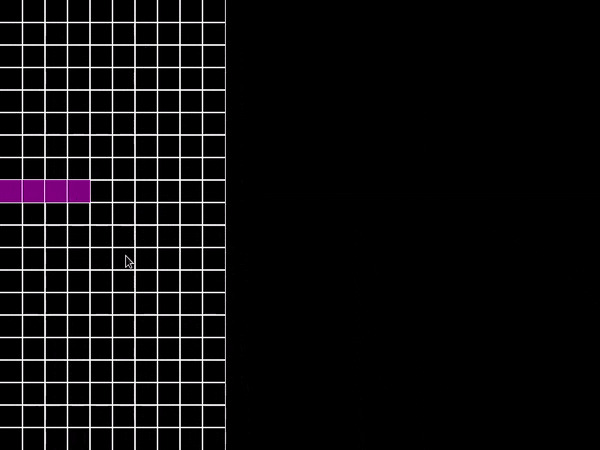

# Tetris Development Guide: Implementing Tetromino Movement and Adjusting Drop Speed

In this guide, we'll walk through the process of implementing left and right movement for the Tetromino entity and adjusting its drop speed in our Tetris game. We'll focus on handling user input for horizontal movement and using a timer for controlled vertical movement.

## 1. Updating the GameState Class

### Step 1: Modify GameState.hpp

Open `Core/include/GameState.hpp` and update it as follows:

```c++
#pragma once

#include <Board.hpp>
#include <Tetromino.hpp>

class GameState
{
public:
  GameState();

  void update(float deltaTime);
  void moveTetromino(int dx);
  const Board &getBoard() const { return board; }
  const Tetromino& getCurrentTetromino() const { return currentTetromino; }

private:
  Board board;
  Tetromino currentTetromino;

  float fallTimer;
};
```

**Why?**
- We've added a `moveTetromino` method to handle horizontal movement.
- We've introduced a `fallTimer` to control the Tetromino's drop speed.
- We've updated the `update` method to accept a `deltaTime` parameter for time-based updates.

### Step 2: Implement GameState Methods

Update `Core/src/GameState.cpp`:

```c++
#include "GameState.hpp"

GameState::GameState() : fallTimer(0.f) {}

void GameState::update(float deltaTime)
{
  fallTimer += deltaTime;
  if (fallTimer >= 1.f) { // 1.0f sets the maximum speed to allow for a move
    currentTetromino.move(0, 1);
    fallTimer = 0.f;
  }
}

void GameState::moveTetromino(int dx)
{
  Tetromino movedTetromino = currentTetromino;
  movedTetromino.move(dx, 0);
  currentTetromino = movedTetromino;
}
```

**Why?**
- The constructor initializes `fallTimer` to 0.
- The `update` method now uses `deltaTime` to increment the `fallTimer`. When it reaches 1 second, the Tetromino moves down and the timer resets.
- `moveTetromino` creates a copy of the current Tetromino, moves it horizontally, and then assigns it back. This allows for future collision checking before finalizing the move.

## 2. Updating the Game Class

### Step 1: Modify Game.hpp

Update `Game.hpp`:

```c++
#pragma once
#include <BoardEntity.hpp>
#include <GameState.hpp>
#include <Renderer.hpp>
#include <SFML/Graphics.hpp>
#include <TetrominoEntity.hpp>

class Game
{
public:
  Game();
  void run();

private:
  void processEvents();
  void handleKeyPress(sf::Keyboard::Key key);
  void render();
  void initializeGame();
  void update(float deltaTime);
  void updateEntities();

  sf::RenderWindow m_window;

  Renderer m_renderer;
  Camera m_camera;
  GameState m_gameState;

  BoardEntity m_boardEntity;
  TetrominoEntity m_currentTetrominoEntity;

  sf::Clock m_clock;
  float m_deltaTime;
};
```

**Why?**
- We've added `m_clock` and `m_deltaTime` to handle time-based updates.
- We've updated the `update` method to accept `deltaTime`.

### Step 2: Implement Game Methods

Update `Game.cpp`:

```c++
#include "Game.hpp"
#include <iostream>

Game::Game()
  : m_window(sf::VideoMode(800, 600), "TetrisSFML"), m_boardEntity(m_gameState.getBoard()), m_renderer(m_window),
    m_camera(800.f, 600.f), m_currentTetrominoEntity(m_gameState.getCurrentTetromino()), m_deltaTime(0.f)
{
  initializeGame();
}

void Game::run()
{
  while (m_window.isOpen()) {
    m_deltaTime = m_clock.restart().asSeconds();

    processEvents();
    update(m_deltaTime);
    render();
  }
}

void Game::handleKeyPress(sf::Keyboard::Key key)
{
  switch (key) {
  case sf::Keyboard::Right:
    m_gameState.moveTetromino(1);
    break;
  case sf::Keyboard::Left:
    m_gameState.moveTetromino(-1);
    break;
  }
}

void Game::update(float deltaTime)
{
  m_gameState.update(deltaTime);
  updateEntities();
}

// ... (other methods remain the same)

void Game::initializeGame()
{
  // Set up the window
  m_window.setFramerateLimit(60);

  // Initialize the camera
  m_camera.setCenter(sf::Vector2f(400, 300));
  m_renderer.setView(m_camera);

  // Set up the game board
  m_boardEntity.setPosition(sf::Vector2f(50, 50));
}
```

**Why?**
- We've updated the main game loop to calculate `deltaTime` using an SFML Clock.
- `handleKeyPress` now moves the Tetromino left or right based on user input.
- `update` now passes `deltaTime` to the game state update method.
- We've centered the camera view in `initializeGame`.

## 3. Updating the Camera Class

### Step 1: Modify Camera.hpp

Update `Graphics/include/Camera.hpp`:

```c++
#pragma once
#include <SFML/Graphics.hpp>

class Camera
{
public:
  Camera(float width, float height);

  const sf::View &getView() const;
  void setCenter(const sf::Vector2f& center);

private:
  sf::View m_view;
};
```

### Step 2: Implement Camera Methods

Update `Graphics/src/Camera.cpp`:

```c++
#include "Camera.hpp"

Camera::Camera(float width, float height) : m_view(sf::FloatRect(0, 0, width, height)) {}

const sf::View &Camera::getView() const { return m_view; }

void Camera::setCenter(const sf::Vector2f &center)
{
  m_view.setCenter(center);
}
```

**Why?**
- We've added a `setCenter` method to allow positioning the camera view.

## Result

With these changes, we've implemented horizontal movement for the Tetromino based on user input and adjusted the drop speed using a timer. Here's a summary of what we've achieved:

1. We've added left and right movement to the Tetromino, controlled by user input.
2. We've implemented a timer-based system for the Tetromino's downward movement, allowing for more controlled gameplay.
3. We've updated the main game loop to use delta time for smooth, consistent updates regardless of frame rate.
4. We've improved camera control for better positioning of the game view.


