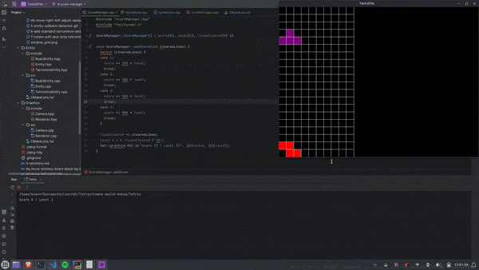

# Tetris Development Guide: Implementing a Score Manager

In this guide, we'll walk through the process of adding a Score Manager to our Tetris game. This will enhance the gameplay by tracking the player's score, level, and lines cleared.

## 1. Creating the ScoreManager Class

### Step 1: Create ScoreManager.hpp

Create a new file `Core/include/ScoreManager.hpp`:

```c++
#pragma once

class ScoreManager {
public:
  ScoreManager();
  void addScore(int clearedLines);
  int getScore() const { return score; }
  int getLevel() const { return level; }
  int getLinesCleared() const { return linesCleared; }

private:
  int score;
  int level;
  int linesCleared;
};
```

**Why?**
- We define a class to encapsulate all score-related functionality.
- We provide methods to add score and retrieve current score, level, and lines cleared.
- This abstraction allows for easy expansion of scoring features in the future.

### Step 2: Implement ScoreManager.cpp

Create a new file `Core/src/ScoreManager.cpp`:

```c++
#include "ScoreManager.hpp"
#include "fmt/format.h"

ScoreManager::ScoreManager() : score(0), level(1), linesCleared(0) {}

void ScoreManager::addScore(int clearedLines) {
  switch (clearedLines) {
  case 1:
    score += 100 * level;
    break;
  case 2:
    score += 300 * level;
    break;
  case 3:
    score += 500 * level;
    break;
  case 4:
    score += 800 * level;
    break;
  }

  linesCleared += clearedLines;
  level = 1 + (linesCleared / 10);
  fmt::println("Score {} | Level {}", score, level);
}
```

**Why?**
- We implement the scoring system based on the number of lines cleared at once.
- The score increases with the current level, rewarding sustained play.
- We update the level based on the total number of lines cleared.
- We use `fmt::println` for formatted output of the current score and level.

## 2. Integrating ScoreManager into GameState

### Step 1: Update GameState.hpp

Modify `Core/include/GameState.hpp`:

```c++
#pragma once
#include "Board.hpp"
#include "Tetromino.hpp"
#include "ScoreManager.hpp"

class GameState {
public:
  // ... (other methods)
  const ScoreManager& getScoreManager() const { return scoreManager; }

private:
  // ... (other members)
  ScoreManager scoreManager;
};
```

**Why?**
- We include the ScoreManager as a member of GameState.
- We provide a getter method to access the ScoreManager.

### Step 2: Update GameState.cpp

Modify `Core/src/GameState.cpp`:

```c++
#include "GameState.hpp"
#include "RandomGenerator.hpp"

// ... (other methods)

void GameState::update(float deltaTime) {
  // ... (other code)
  float fallSpeed = 1.0f - (0.05f * scoreManager.getLevel());
  // ... (rest of the method)
}

void GameState::softDrop()
{
  softDropTimer = 0;  // Reset the soft drop timer
  if (board.isCollision(currentTetromino.getMovedPosition(0, 1))) {
    lockTetromino();
  } else {
    currentTetromino.move(0, 1);
    scoreManager.addScore(1);  // Add a small score for soft dropping
  }
}

void GameState::lockTetromino()
{
  board.placeTetromino(currentTetromino);
  int linesCleared = board.clearLines();
  scoreManager.addScore(linesCleared);
  spawnNewTetromino();
}
```

**Why?**
- We use the player's level to adjust the fall speed, making the game progressively harder.
- We award a small score for soft dropping, encouraging active play.
- We update the score based on the number of lines cleared when a Tetromino is locked.

## 3. Updating the Build System

### Step 1: Update Core/CMakeLists.txt

```cmake
add_library(TetrisCore
        src/Board.cpp
        src/GameState.cpp
        src/Tetromino.cpp
        src/RandomGenerator.cpp
        src/ScoreManager.cpp
)

target_include_directories(TetrisCore PUBLIC include)
target_link_libraries(TetrisCore PRIVATE fmt::fmt)
```

**Why?**
- We add ScoreManager.cpp to the list of source files for TetrisCore.
- We link against fmt::fmt for formatted output in ScoreManager.

## Result

With these changes, we've successfully implemented a Score Manager in our Tetris game:

1. We've created a ScoreManager class to handle score calculations and level progression.
2. We've integrated the ScoreManager into the GameState, allowing it to affect gameplay (like fall speed).
3. We've implemented a scoring system that rewards clearing multiple lines at once and encourages active play through soft drop bonuses.
4. We've set up the build system to include the new ScoreManager files.

